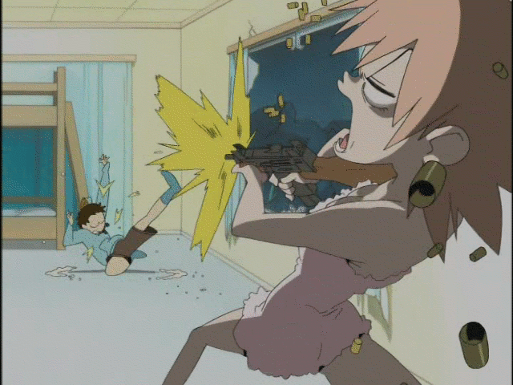

# Basic JS Carousel
A simple, small, reusable JS carousel.


* * *

### How to use it?

Well first you will need a basic html structure that looks  like this:


```html
<section id="carousel">

  <a class="imagecontainer" href="">
    
  </a>
  <a class="imagecontainer" href="">
    
  </a>
  <a class="imagecontainer" href="">
    
  </a>
  <a class="imagecontainer" href="">
    
  </a>
  <a class="imagecontainer" href="">
    
  </a>
  <a class="imagecontainer" href="">
    
  </a>
</section>

<button id="btnright"></button>
<button id="btnleft"></button>

```
* * *

The css is pretty basic and looks like this:

```css
#carousel {
  background-color: #e9e9e960;
  min-height: 40vw;
  max-height: 40vw;
  margin: 0;
  padding: 0;
  display: flex;
  align-items: center;
  position: relative;
  max-height: 500px;
  overflow-x: auto;
  overflow-y: hidden;
  scroll-behavior: smooth;
  scroll-snap-type: x mandatory;
  -webkit-overflow-scrolling: touch;

  scrollbar-width: none;

}

#carousel::-webkit-scrollbar {
display: none;
}

#btnleft {
  left: 0vw;
}

#btnright {
  right: 0vw;
}

#btnright,
#btnleft {
  font-family: "Sauce Code Pro";
  font-size: 1.6vw;
  color: #555555;
  z-index: 999;
  width: 3vw;
  border-style: none;
  position: absolute;
  top: 0;
  height: 100%;
  background-color: #d4d4d4a4;
}

#btnright:hover,
#btnleft:hover {
  color: #959595;
  background-color: #dededee4;
  cursor: pointer;
}

.imagecontainer {
  object-fit: cover;
  box-sizing: border-box;
  image-rendering: auto;
  height: 50vw;
  min-height: 50vw;
  min-width: 100%;
  margin: 0;
  padding: 0;
  scroll-snap-align: auto;
}

.imagecontainer>img {
  min-height: 50vw;
  object-fit: cover;
  object-position: 90% 90%;
  min-width: 80vw;
}

.imagecontainer:hover {
  filter: brightness(1.2);
  max-height: 105%;
}
```

* * * 
Then all you have to do is to add the classes and ids you use to this first part of the script and include it in your html head.

```javascript
document.addEventListener("DOMContentLoaded", () => {

  //Define your variables here:
  const cid = '#carousel';                //carrousel id
  const imgclass = 'imagecontainer';      //images class
  const btnL = '#btnleft';                //Left button id
  const btnR = '#btnright';               //right button id

  const timer = 2000;                     //timer in ms for the carousel to autoswitch, leave zero for no autoswitch;
  const autoSwitchDir = 1;                //direction for the carrousel to move automatically

  setupCarousel(cid, imgclass, btnL, btnR, timer, autoSwitchDir);

})
```

* * *

### how does it work? 

it uses a data attribute called data-pos in the html carousel to keep track of the carousel scrollbar position and reads it everytime it has to calculate a new position, then it just sums it with the width of the image container(all images are cropped so they have the same width/height) and bam we now have the position to the next image (nextpos = pos + width * dir)

if you want to understand better you can just check out the code itself, it's actually pretty small and well commented.

hope it helps you :3


